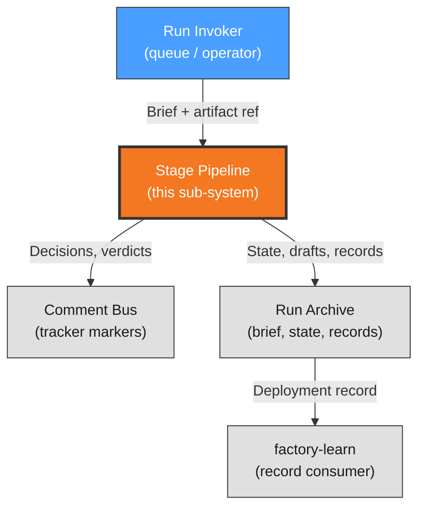

# Context View: orchestration

**Sub-System**: orchestration
**ADRs**: ADR-003
**Generated**: 2026-10-04
**Dependencies**: None (first in DAG)

---

## Context (orchestration)

**Purpose**: Run-lifecycle scope — the 8-stage pipeline, route classification, dual-channel outputs, and program-counter resume that carry a release from intake to close-out.

### System Scope

The orchestration sub-system owns the run as a durable workflow: up-front route classification recorded in the brief (full / short-path / halt), stage execution in DAG order with typed outputs, dual-channel state (comment-bus markers for decisions/verdicts, run-state files for drafts/previews/records), and lease program-counter resume where closed stages never re-execute. Mid-run adaptation happens through the correction loop, never re-routing.

### External Entities

| Entity | Type | Interaction Type | Data Exchanged | Protocols |
|--------|------|------------------|----------------|-----------|
| Run invoker | System (factory-queue / operator) | Provides artifact ref or approved head + route hints | Mission brief, artifact ref | Executor invocation |
| Comment bus | System (tracker markers) | Publishes decisions, verdicts, completion | Marker comments with run/step/status | TrackerPort marker-write |
| Run archive | System (local state) | Persists brief, state.json, lease, records | Files under runs archive directory | Filesystem |
| Downstream skills | System (factory-learn, factory-monitor) | Consume deployment record + handoff packet | Record JSON, packet fields | File read |

### Context Diagram

### External Dependencies

| Dependency | Purpose | SLA Expectations | Fallback Strategy |
|------------|---------|------------------|-------------------|
| Comment bus writes | Cross-session decision memory | Tracker availability | Local files remain authoritative (program counter); markers backfilled on recovery |
| Run archive durability | Lease, state, records | Local disk reliability | Corrupt state = halt, never guess; human resumes from markers |
