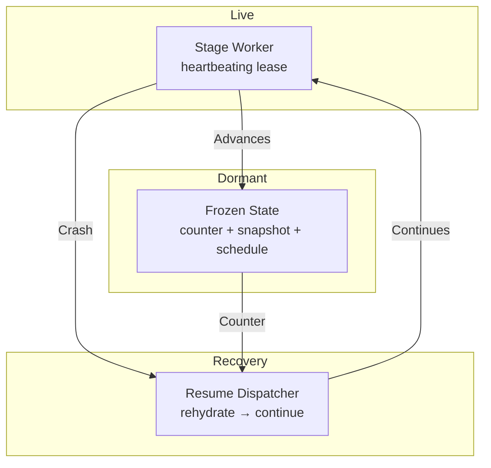

# Deployment View: orchestration

**Sub-System**: orchestration
**ADRs**: ADR-003
**Generated**: 2026-10-04
**Dependencies**: Development (orchestration/)

---

## Deployment (orchestration)

**Purpose**: Where runs execute and resume — session topology across crashes, compactions, and windows.

### Runtime Environments

| Environment | Purpose | Infrastructure | Scale |
|-------------|---------|----------------|-------|
| Active session | Current stage worker + heartbeats | Agent host | 1 per live run |
| Dormant (armed windows) | No process; state + schedule persist | Archive + scheduler | Unbounded (state is cheap) |
| Resume session | Fresh session rehydrating from counter | Agent host (possibly different runtime) | On demand |

### Network Topology

### Hardware Requirements

| Component | CPU | Memory | Storage |
|-----------|-----|--------|---------|
| Stage worker | Per-stage tool budget | Session context | Outputs to archive |
| Dormant state | Zero | Zero | KBs (state.json + snapshots) |
| Env locks | Negligible | Shared lock table | Entries per environment |
