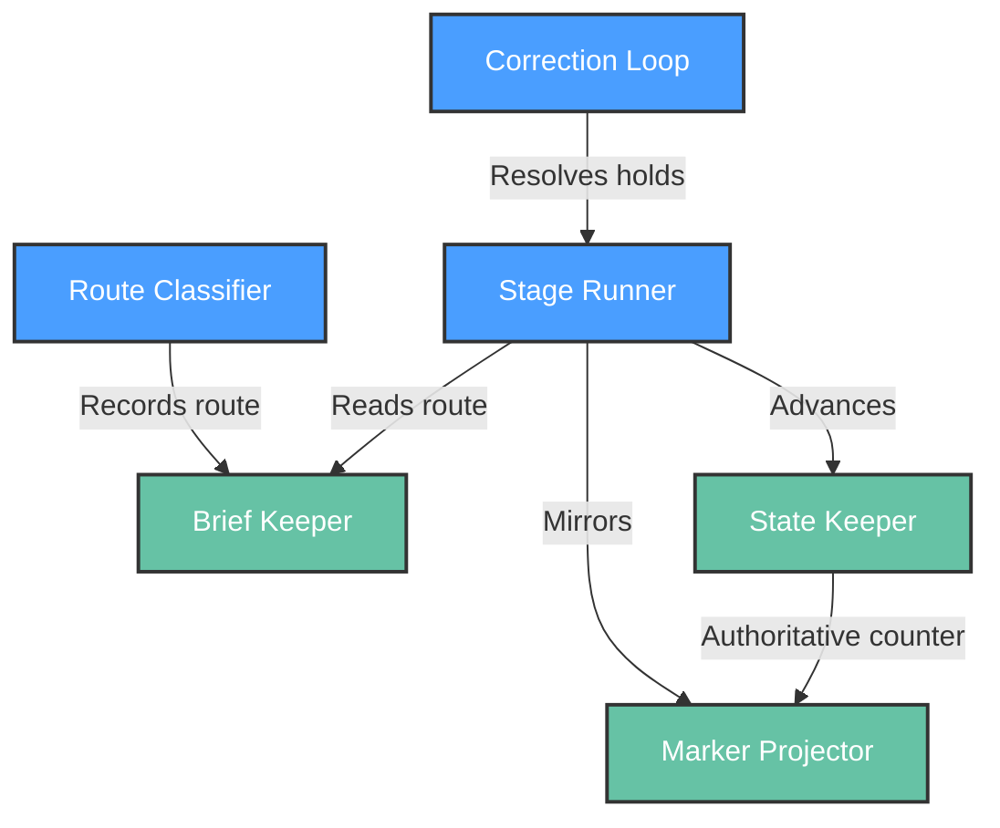

# Functional View: orchestration

**Sub-System**: orchestration
**ADRs**: ADR-003
**Generated**: 2026-10-04
**Dependencies**: Context View (orchestration/context.md)

---

## Functional (orchestration)

**Purpose**: Run-lifecycle elements — classification, stage execution, dual-channel state, and resume.

### Functional Elements

| Element | Responsibility | Interfaces Provided | Dependencies |
|---------|----------------|---------------------|--------------|
| Route Classifier | Decide full / short-path / halt at intake from release metadata + `verify` rules | Route verdict recorded in brief | Brief inputs, short-path rule text |
| Stage Runner | Execute 8 stages in DAG order with typed outputs | Per-stage `output_type` (findings/decision/artifact-ref) | Executor Engine, program counter |
| Brief Keeper | Own the run brief (goal, constraints, route, frozen references) | Brief read for resumed/cross-runtime workers | Run archive |
| State Keeper | Program-counter state.json; closed stages never re-execute | State read/write; resume entrypoint | Lease Manager (liveness) |
| Marker Projector | Mirror decisions/verdicts to comment bus; backfill on recovery | Marker comments per run/step/status | TrackerPort |
| Correction Loop | Route hold/rollback outcomes to human or bounded retry (max_corrections) | Hold/continue/abort transitions | Safety verdicts (input) |

### Element Interactions

### Functional Boundaries

**What this sub-system DOES:**

- Classify once, record forever; execute in order; remember durably in two channels.
- Resume crashed runs from the program counter without re-executing closed stages.
- Adapt mid-run only through the correction loop (hold → human), never re-routing.

**What this sub-system does NOT do:**

- Decide whether a gate passes (safety authorizes; orchestration records).
- Compute rollout verdicts (safety evaluates; orchestration advances on them).
- Produce release artifacts (release cuts; orchestration sequences).
