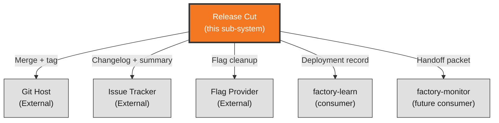

# Context View: release

**Sub-System**: release
**ADRs**: ADR-006
**Generated**: 2026-10-04
**Dependencies**: None (first in DAG)

---

## Context (release)

**Purpose**: Artifact-and-evidence scope — the release cut (merge → tag → changelog → flag-cleanup) and the machine-readable evidence (deployment record + monitor handoff packet) that outlive the run.

### System Scope

The release sub-system owns everything that leaves the run: exact-head merge execution under both-green gates, SemVer tag-as-truth cut, tracker-generated impact-grouped changelog with approver edits, flag cleanup per lifecycle rules, and the versioned `deploy-record/1` evidence schema (lenient-additive governance). Cut steps are idempotent and ordered; evidence is written for decoupled future consumers.

### External Entities

| Entity | Type | Interaction Type | Data Exchanged | Protocols |
|--------|------|------------------|----------------|-----------|
| Git host | External System | Merge execution, tag creation | SHAs, tag refs, merge results | Git + host API |
| Issue tracker | External System | Changelog section write-back, completion summary | Generated notes, approver edits, lifecycle transition | TrackerPort operations |
| Flag provider | External System | Post-rollout flag + dead-code-path cleanup | Flag removal, expiry confirmation | FlagPort cleanup |
| factory-learn | System (future consumer) | Mines deployment records into ChDR candidates | `deploy-record/1` JSON | File read |
| factory-monitor | System (future consumer) | Consumes handoff packet as input contract | Endpoints, alert status, known-unknowns | File read |

### Context Diagram

### External Dependencies

| Dependency | Purpose | SLA Expectations | Fallback Strategy |
|------------|---------|------------------|-------------------|
| Git host availability | Merge + tag | Host SLA | Halt pre-mutation; pre-flight fails run before any write on missing primitives |
| Tracker write access | Changelog + summary | Provider SLA | Changelog staged locally; published on recovery; never partial-published |
| Schema consumers (future) | Record/packet reading | N/A (file-based) | Additive evolution keeps old readers working; breaking change = major + ADR |
