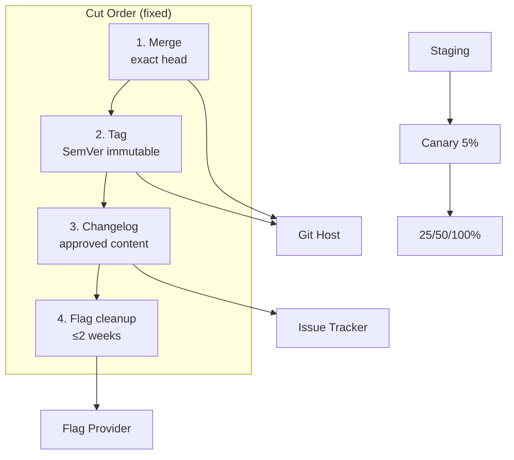

# Deployment View: release

**Sub-System**: release
**ADRs**: ADR-006
**Generated**: 2026-10-04
**Dependencies**: Development (release/)

---

## Deployment (release)

**Purpose**: Where artifacts land — git host, tracker, flag provider — and the order they land in.

### Runtime Environments

| Environment | Purpose | Infrastructure | Scale |
|-------------|---------|----------------|-------|
| Staging | Pre-release verification target | Target app staging env (operator-provided) | 1 per release |
| Production canary | 5% rollout target | Target app prod (flag-sliced) | Percentage-sliced traffic |
| Production full | 25/50/100% expansion target | Target app prod | Full traffic at close |
| Git host | Merge + immutable tag home | Provider host | 1 tag per release |
| Tracker | Changelog section + completion summary home | Provider host | 1 section + 1 summary per release |

### Network Topology

### Hardware Requirements

| Component | CPU | Memory | Storage |
|-----------|-----|--------|---------|
| Target envs (staging/prod) | Operator-owned (not this skill) | Operator-owned | Operator-owned |
| Git host | Tag refs (bytes) | — | Refs namespace |
| Tracker | Section + summary text | — | Issue comments |
| Run archive | Record + packet JSON (KBs) | — | Per-run retention |
