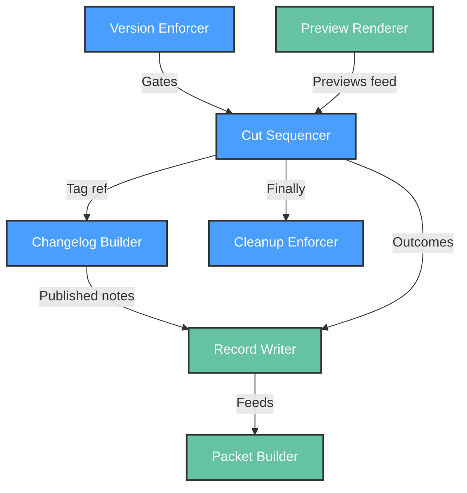

# Functional View: release

**Sub-System**: release
**ADRs**: ADR-006
**Generated**: 2026-10-04
**Dependencies**: Context View (release/context.md)

---

## Functional (release)

**Purpose**: Cut-and-evidence elements — turning an authorized, green release into immutable artifacts and machine-readable records.

### Functional Elements

| Element | Responsibility | Interfaces Provided | Dependencies |
|---------|----------------|---------------------|--------------|
| Cut Sequencer | Fixed order merge → tag → changelog → flag-cleanup; per-step idempotency keys (SHA/tag-name/content-hash) | Skip-if-key-present resume per step | Git host, TrackerPort, FlagPort |
| Version Enforcer | Strict SemVer validation pre-mutation; version derived from tag; no tag = no release | Version gate verdict | Spec-kit SemVer rules |
| Changelog Builder | Tracker-generated impact-grouped notes; approver edits applied from preview | Changelog section draft → published section | Tracker items, preview approval |
| Preview Renderer | Dry-run diffs for every mutation (merge, flag flip, changelog, tag, migration) | Preview artifacts in run archive | Cut Sequencer (planned ops) |
| Record Writer | Versioned `deploy-record/1` JSON (artifact, SHAs, gates+approvers, verdicts+baselines, rollback rationale) | Record file; additive `1.x` evolution | All run outputs |
| Packet Builder | Monitor handoff packet (metrics endpoints, alert/runbook status, known-unknowns) | Packet file for future factory-monitor | Record Writer, verification results |
| Cleanup Enforcer | Flag + dead-code-path removal within lifecycle rule (≤2 weeks, owner + expiry) | Cleanup confirmation or recorded expiry | FlagPort |

### Element Interactions

### Functional Boundaries

**What this sub-system DOES:**

- Cut releases in a fixed, retry-safe order and prove it with idempotency keys.
- Generate notes from tracker data while preserving human curation at preview time.
- Leave behind evidence machines can read (schema) and monitors can consume (packet).

**What this sub-system does NOT do:**

- Authorize anything (both gates live in safety; cut executes authorizations).
- Evaluate rollout health (safety verdicts gate the cut's progression).
- Monitor production continuously (packet hands off; run closes).
