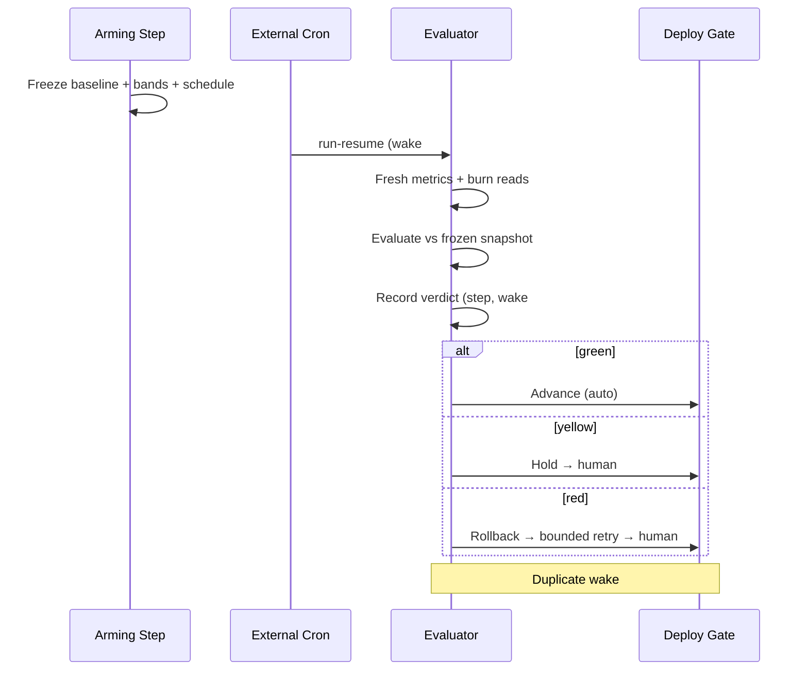

# Concurrency View: safety

**Sub-System**: safety
**ADRs**: ADR-004, ADR-005
**Generated**: 2026-10-04
**Dependencies**: Functional, Information (safety/)

---

## Concurrency (safety)

**Purpose**: Evaluation lifecycle across windows — arming, sleeping, waking, verdicting — without held workers.

### Process Structure

| Process | Purpose | Scaling Model | State Management |
|---------|---------|---------------|------------------|
| Arming step | Freeze baseline snapshot + thresholds + wake schedule into run state | Once per canary/expansion step | Snapshot immutable after arm |
| External cron wake | Invoke run-resume at scheduled times | Provider-scheduled; pre-flight verified | Schedule recorded in run state |
| Evaluator dispatch | Fresh metrics + burn reads → band verdict → record → act | One dispatch per wake; idempotent re-computation | Verdict keyed by (step, wake#); duplicates converge |
| Gate watchers | Observe approval/label/marker state at checkpoints + execution re-read | Event-driven on human action | No polling; reads on demand |

### Thread Model

- **Threading Strategy**: None held — the window is data (schedule + snapshot), not a process.
- **Async Patterns**: Wake → evaluate → advance/hold/rollback → re-arm or close; bounded retries on metrics outage, then human.
- **Resource Pools**: Evaluator dispatches are short-lived and unbounded in count but idempotent in effect.

### Coordination Mechanisms

- **Synchronization**: Verdict keying (step + wake number) prevents double-advance on duplicate wakes.
- **Communication**: Verdicts published to bus + state; gates read approvals from tracker, never from evaluator output.
- **Deadlock Prevention**: No locks held across windows; evaluator never waits on gates and gates never wait on the evaluator — the DAG order (gates before/around evaluation windows) is the deadlock freedom argument.

