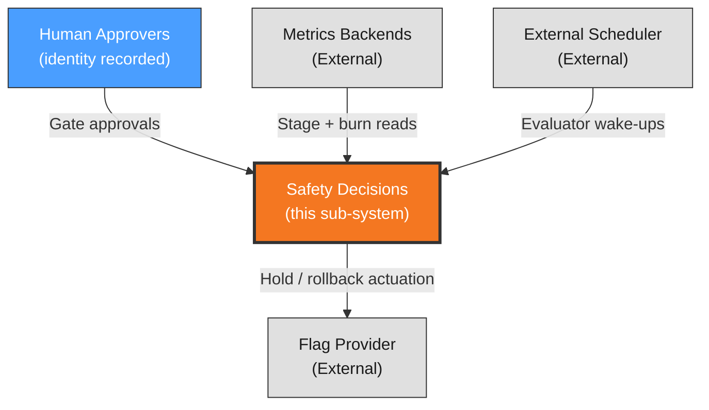

# Context View: safety

**Sub-System**: safety
**ADRs**: ADR-004, ADR-005
**Generated**: 2026-10-04
**Dependencies**: None (first in DAG)

---

## Context (safety)

**Purpose**: Decision-safety scope — who may authorize what (two gates), how releases advance or stop (threshold verdicts + budget), and how forgery and staleness are handled. The sub-system with the largest blast-radius logic.

### System Scope

The safety sub-system owns every halt/advance decision: tracker-native gate observation with SHA-bound execution-time re-read (Merge Gate readiness + Deploy Gate authorization), halt-on-identity-mismatch, armed evaluator verdicts over frozen baselines with scheduled wake-ups, unified SLO/budget evaluation, and the eight invariants (including recorded budget override). The evaluator computes; gates authorize; neither does the other's job.

### External Entities

| Entity | Type | Interaction Type | Data Exchanged | Protocols |
|--------|------|------------------|----------------|-----------|
| Human approvers | System (any human, identity recorded) | Approve Deploy Gate checkpoints; Merge Gate per review rules | Approval state, labels, checkpoint markers | Tracker-native UX |
| Metrics backends | External System | Evaluator pulls stage metrics + SLO/burn state at wake-ups | Error rate, p95, JS errors, business metrics, burn rate | Metrics port reads |
| External scheduler | External System | Wake-up dispatch for armed evaluators | Run ID + wake schedule | Scheduler trigger |
| Flag provider | External System (via FlagPort) | Rollback/hold actuation on red/yellow | Flag percentage changes | FlagPort operations |

### Context Diagram

### External Dependencies

| Dependency | Purpose | SLA Expectations | Fallback Strategy |
|------------|---------|------------------|-------------------|
| Metrics availability at wake | Verdict computation | Backend SLA | Outage = hold + bounded retry, never green |
| Scheduler reliability | Window wake-ups | Cron reliability | Missed wake = stale-lease halt on next contact |
| Tracker approval state | Gate observation | Provider SLA | Unavailable = halt; never cached-gate execution |
