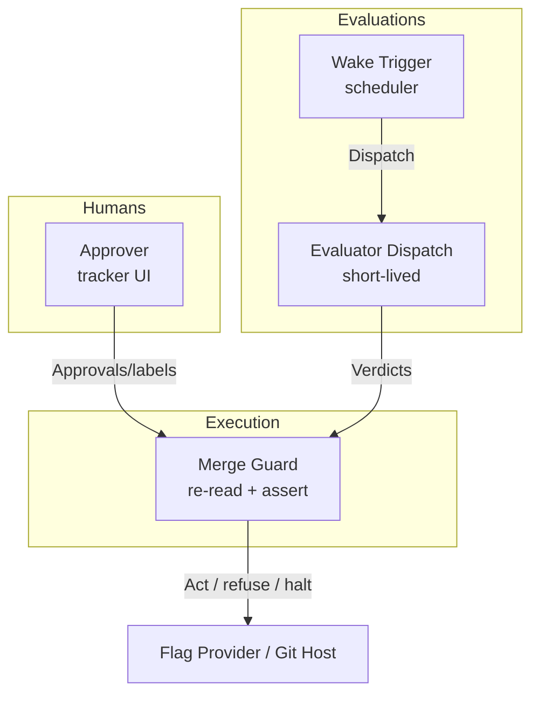

# Deployment View: safety

**Sub-System**: safety
**ADRs**: ADR-004, ADR-005
**Generated**: 2026-10-04
**Dependencies**: Development (safety/)

---

## Deployment (safety)

**Purpose**: Where authorization and evaluation physically happen — approval surfaces, evaluator dispatches, and outage postures.

### Runtime Environments

| Environment | Purpose | Infrastructure | Scale |
|-------------|---------|----------------|-------|
| Tracker UI/API | Human approvals, labels, checkpoint markers | Provider host | Human-paced |
| Evaluator dispatch | Short-lived verdict computation per wake | Agent host (fresh dispatch) | 1 per wake per step |
| Merge execution instant | Re-read + SHA assert + act/refuse | Agent host at merge step | 1 per release |
| Metrics backends | Stage + burn reads | Existing observability stack | Per wake reads |

### Network Topology

### Hardware Requirements

| Component | CPU | Memory | Storage |
|-----------|-----|--------|---------|
| Evaluator dispatch | Brief compute per wake | Metrics payload | Verdict record (KBs) |
| Gate observation | Negligible (reads) | Marker content | Checkpoint markers |
| Merge guard | Negligible + git ops | Head SHAs | Re-read values in record |
