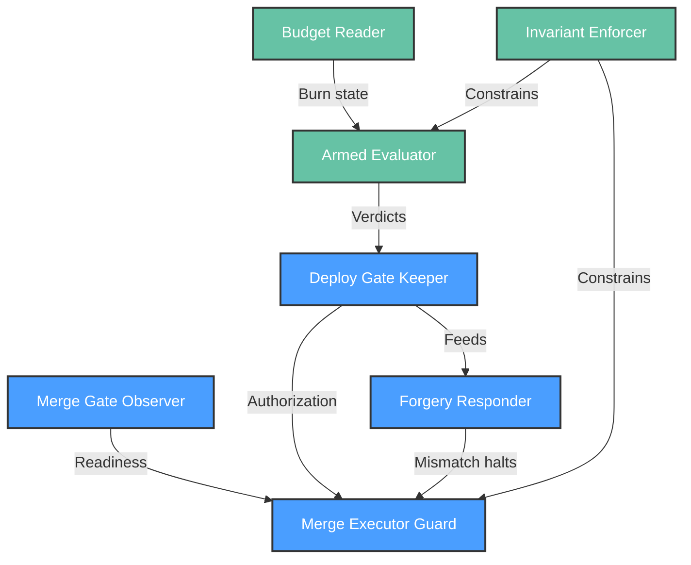

# Functional View: safety

**Sub-System**: safety
**ADRs**: ADR-004, ADR-005
**Generated**: 2026-10-04
**Dependencies**: Context View (safety/context.md)

---

## Functional (safety)

**Purpose**: Authorization and evaluation elements — who may approve, how releases advance or stop, and how dishonesty and staleness are handled.

### Functional Elements

| Element | Responsibility | Interfaces Provided | Dependencies |
|---------|----------------|---------------------|--------------|
| Merge Gate Observer | Read review-owned readiness (approval state / deploy-ready label) | Readiness boolean + evidence refs | TrackerPort |
| Deploy Gate Keeper | Own authorization checkpoints (promote, canary-expand, merge-execution); any human, identity recorded | Checkpoint markers; halt-until-approved | TrackerPort, lease (pause) |
| Merge Executor Guard | Re-read both gates at execution instant; assert head-SHA equality; act or refuse | Merge/no-merge verdict with re-read values | Both gate observers, git host |
| Forgery Responder | Compare marker identity vs approval authority; halt (resumable) on mismatch | Halt + investigation record | Deploy Gate Keeper |
| Armed Evaluator | Compute band verdicts over frozen baselines at wake-ups (error, p95, JS errors, business, burn) | Advance / hold / rollback verdict + inputs | Metrics port, baseline snapshot, wake schedule |
| Budget Reader | Unified SLO/burn reads inside every verdict (canary burn = hold signal) | Burn state per evaluation | Metrics port |
| Invariant Enforcer | Eight invariants as mechanical checks (gates halt, exact-head, dry-run, main-ban, plan-required, message-is-data, blackouts, budget freeze + recorded override) | Pass/halt per invariant; override annotation path | All elements above |

### Element Interactions

### Functional Boundaries

**What this sub-system DOES:**

- Authorize (gates) and evaluate (verdicts) — two jobs, two elements, never conflated: the evaluator never approves, gates never compute.
- Halt on forgery, staleness, missing baselines, and tracker outages — absence of data never reads as green.
- Record every verdict with inputs so any advance is reproducible after the fact.

**What this sub-system does NOT do:**

- Execute releases (orchestration sequences; release cuts artifacts).
- Instrument telemetry (build-time concern; evaluator reads, never adds).
- Approve on behalf of humans (explicit orders only, annotated).
