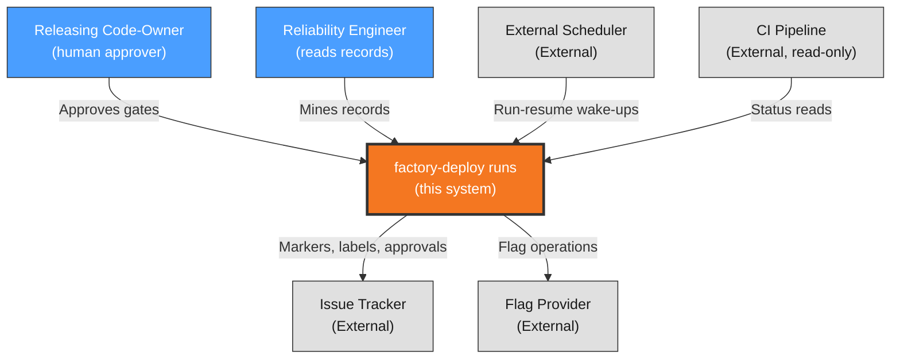

# Context View: system

**Sub-System**: system
**ADRs**: ADR-001, ADR-002
**Generated**: 2026-10-04
**Dependencies**: None (first in DAG)

---

## Context (system)

**Purpose**: Cross-cutting runtime and integration scope — the shared executor contract and the provider port boundaries that all stages run on.

### System Scope

The system sub-system covers what every factory-deploy run assumes: the verbatim shared executor (step schema, output types, comment bus, lease/heartbeat, worktree isolation, circuit breaker) plus the two additive primitives (environment locks, external-cron wake-ups), and the independent `TrackerPort` / `FlagPort` interfaces with their default adapters. It owns no release logic itself — it is the ground the other three sub-systems stand on.

### External Entities

| Entity | Type | Interaction Type | Data Exchanged | Protocols |
|--------|------|------------------|----------------|-----------|
| Issue tracker | External System | Approval state, labels, marker comments via TrackerPort | Gate decisions, approver identity, completion summaries | Provider API (adapter-bound) |
| Flag provider | External System | Percentage/flag operations via FlagPort | Flag state, rollout percentages | Provider API (adapter-bound) |
| External cron/scheduler | External System | Invokes run-resume for armed evaluator wake-ups | Run ID, wake schedule | Scheduler-native trigger |
| CI pipeline | External System | Status read-only (never executed) | Gate statuses per commit | Provider API |

### Context Diagram

### External Dependencies

| Dependency | Purpose | SLA Expectations | Fallback Strategy |
|------------|---------|------------------|-------------------|
| Tracker availability | Gate observation + audit bus | Provider SLA | Halt (lease-kept); never act on cached gate state |
| Flag provider availability | Rollout actuation | Provider SLA | Halt expansion; hold current percentage |
| External scheduler | Evaluator wake-ups | Cron reliability | Missed wake surfaces as stale-lease halt on next contact |
| CI status API | Verify gates | Provider SLA | Cannot verify → cannot proceed (no tag, no release) |
