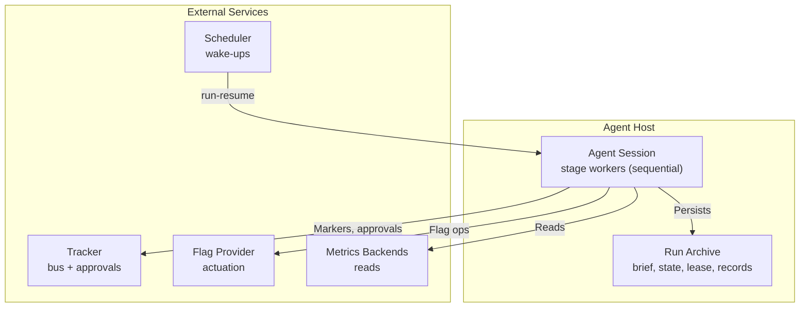

# Deployment View: system

**Sub-System**: system
**ADRs**: ADR-001, ADR-002
**Generated**: 2026-10-04
**Dependencies**: Development (system/)

---

## Deployment (system)

**Purpose**: Where the runtime and adapters live — environments, bindings, and what runs where.

### Runtime Environments

| Environment | Purpose | Infrastructure | Scale |
|-------------|---------|----------------|-------|
| Agent session | Stage execution, gate approvals, verdict review | Existing factory host (opencode/CLI sessions) | 1 run = 1 session context at a time |
| External scheduler | Evaluator wake-ups (run-resume triggers) | Cron / scheduler service (operator-provided) | Per armed window |
| Tracker host | Comment bus, approvals, labels | Provider SaaS / self-hosted | Per run issue/PR |
| Flag provider | Percentage/flag actuation | Provider SaaS / self-hosted | Per target environment |

### Network Topology

### Hardware Requirements

| Component | CPU | Memory | Storage |
|-----------|-----|--------|---------|
| Agent session | Existing host capacity | Conversation + tool budget | Run archive (KBs per run) |
| Scheduler | Negligible (triggers only) | Negligible | Schedule list |
| No dedicated servers | — | — | Nothing to provision (explicit non-goal) |
