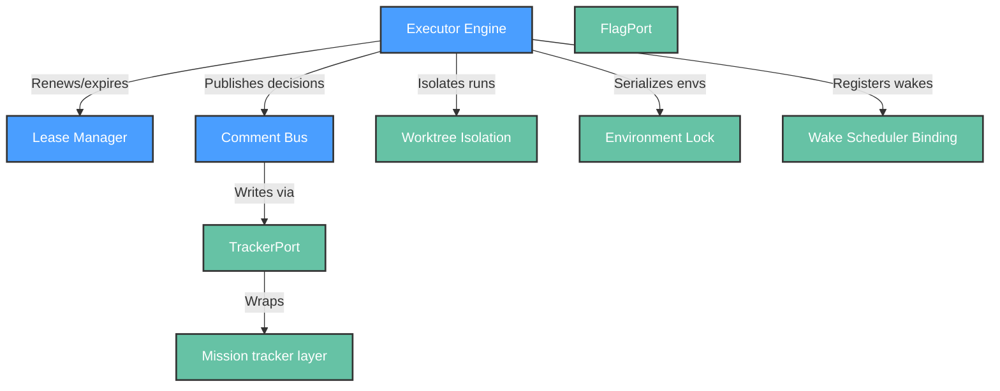

# Functional View: system

**Sub-System**: system
**ADRs**: ADR-001, ADR-002
**Generated**: 2026-10-04
**Dependencies**: Context View (system/context.md)

---

## Functional (system)

**Purpose**: Cross-cutting runtime elements and provider seams every stage runs on.

### Functional Elements

| Element | Responsibility | Interfaces Provided | Dependencies |
|---------|----------------|---------------------|--------------|
| Executor Engine | Step dispatch, DAG order, typed outputs, circuit breaker | Step schema, `output_type` discipline | Run state (program counter) |
| Lease Manager | Renewable liveness (heartbeat + TTL), live/stale/completed distinction | Lease acquire/renew/expire; stale-lease halt | Local lease store |
| Comment Bus | Durable inter-agent memory via tracker markers | Marker write/read (decisions, verdicts, completion) | TrackerPort marker-write |
| Worktree Isolation | Isolated execution checkouts per run | Worktree create/remove under runs root | Git worktrees |
| Environment Lock | Serialize same-environment runs (additive primitive #1) | Lock acquire/check/release per environment | Shared lock state |
| Wake Scheduler Binding | External-cron wake-up registration + verification (additive primitive #2) | Schedule exists-check pre-arm; run-resume entrypoint | External scheduler |
| TrackerPort | Approval-state, label-read, marker-write behind vendor-free interface | Port operations; default adapter wraps mission tracker layer | Tracker provider binding |
| FlagPort | Flag create/flip/percentage/read/cleanup, integer-percent | 5 port operations; in-memory fake for tests | Flag provider binding |

### Element Interactions

### Functional Boundaries

**What this sub-system DOES:**

- Provide the identical runtime every factory orchestrator shares, plus two proven-additive primitives.
- Keep stages vendor-free behind ports with a reused (tracker) and a narrow new (flags) adapter.
- Make liveness, memory, and isolation someone else's solved problem.

**What this sub-system does NOT do:**

- Release logic, gate policy, or verdict computation (orchestration/safety).
- Tracker business rules or flag rollout strategy (callers' concern).
- Prometheus-style monitoring of itself (consumer-side concern).
