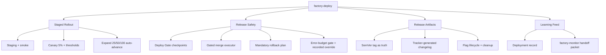
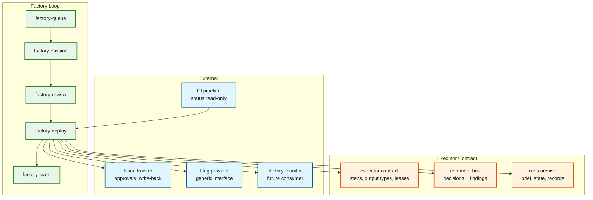
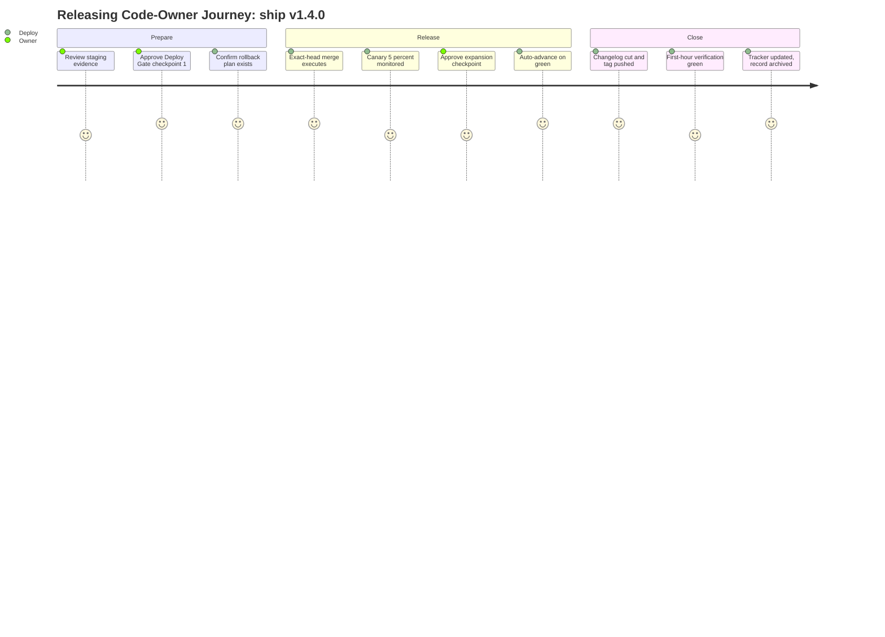
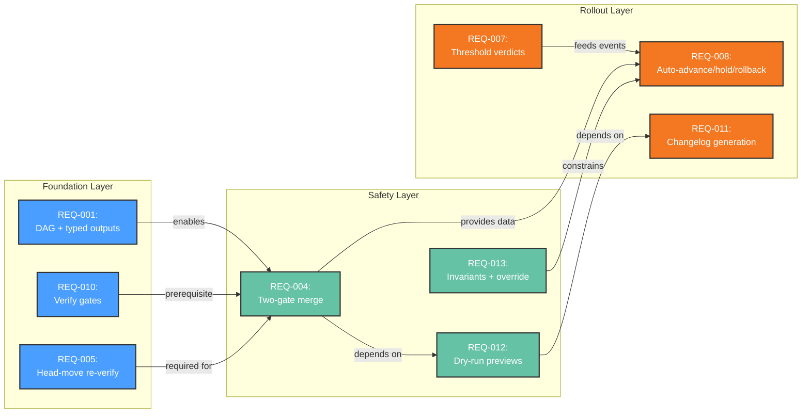
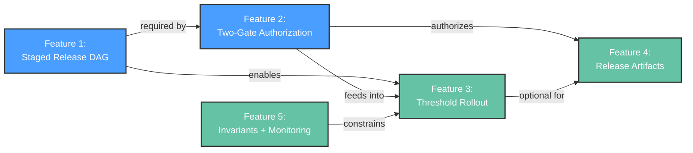
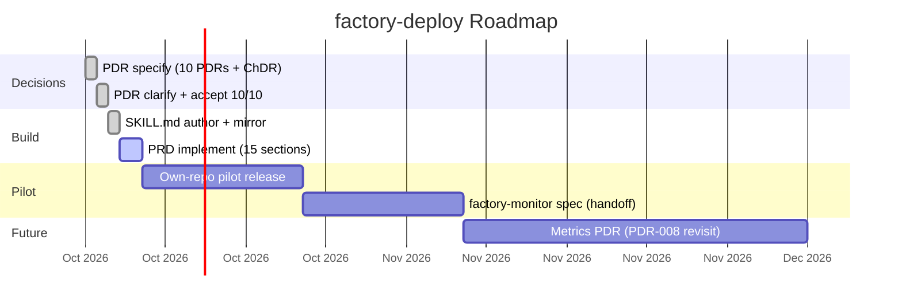

# Product Requirements Document: factory-deploy

> Self-contained PRD compiled from 10 Accepted PDRs (PDR-001…PDR-010) plus supporting ChDR-001. PDRs are the source of truth for conflict resolution; every section traces to them. No reader-facing repository links; PDRs cited as plain IDs.

## 1. Document Information

| Field | Value |
|-------|-------|
| **Document** | Product Requirements Document — factory-deploy |
| **Version** | 1.0 (pending final review) |
| **Status** | Pre-implementation — all 15 sections complete |
| **Authors** | User / AI collaboration (product-specify session 2026-10-04) |
| **Source PDRs** | PDR-001…PDR-010 (all Accepted), ChDR-001 (supporting, Proposed) |
| **Skill** | factory-deploy skill (authored, 113 lines, integrity + sync suites green) |
| **Upstream references** | addyosmani/agent-skills ship phase; agentic-sdlc-spec-kit RELEASE.md (SemVer) |

### Revision History

| Date | Version | Change |
|------|---------|--------|
| 2026-10-04 | 0.1 | Phase 2a sections 1–7; Requirements checkpoint approved (A) |
| 2026-10-04 | 0.5 | Phase 2b sections 8–12 complete |
| 2026-10-04 | 1.0 | Aggregated PRD; pending final review |

### Approval

| Role | Name | Decision | Date |
|------|------|----------|------|
| DAG plan | User | Approved (Yes) | 2026-10-04 |
| Requirements checkpoint | User | Approved (A) | 2026-10-04 |
| Final PRD | — | Pending | — |

## 1.5 Executive Summary

### The Opportunity

The software factory currently ends at merge-ready: intake, execution, review, and learning are automated, but the highest-blast-radius mile — staging, rollout, monitoring, rollback, release notes — is manual and unaudited. Closing that gap with a gated release orchestrator makes every factory release as disciplined as every factory build.

### The Problem

- **Orphaned last mile**: reviewed, merge-ready artifacts wait on manual deploys with no owner, no gates, and no audit trail (PDR-001).
- **Unmeasured rollouts**: releases ship without staged canaries, threshold verdicts, or guaranteed rollback plans — risk is carried, not managed (PDR-006).
- **Gate inconsistency**: siblings enforce Intent, clarify, and Merge gates, but shipping has no gate vocabulary at all (PDR-004).

### The Solution

`factory-deploy`: a Kind-A DAG orchestrator (PDR-005) that takes a merged artifact through staging → prod-canary (5%) → gradual expansion (25/50/100%) with green/yellow/red threshold verdicts, three human Deploy Gate checkpoints, SemVer tagging + tracker-generated changelog, and a deployment record feeding `factory-learn`. Release content is adapted from the field-tested ship phase; gates, resume, and audit come from the factory executor.

**Key Capabilities:**
- Staged rollout with mechanical advance/hold/rollback verdicts — releases advance on evidence, not vibes.
- Gated merge executor + dry-run previews — the agent executes, humans authorize, SHAs always match.
- Mandatory rollback plan + error-budget gate — no plan, no staging; exhausted budget freezes features unless explicitly overridden and recorded.

### Business Impact

| Metric | Current State | Target (12 months) | Value |
|--------|--------------|-------------------|-------|
| Manual deploy toil per release | Human drives every step | 3 gate approvals per release, rest autonomous | Frees code-owner hours; quantified after adoption (PDR-008 deferred) |
| Rollback readiness | Ad-hoc, sometimes absent | Rollback plan mandatory pre-stage; time targets flag <1min / redeploy <5min / DB <15min | MTTR bounded by construction |
| Release auditability | None | Every verdict, gate, and override on the comment bus + run archive | Incident review answers "why did this ship?" in minutes |

### Investment Required

| Category | Amount | Timeline |
|----------|--------|----------|
| **Personnel** | Sessions + review time (specify, clarify, implement complete) | Done 2026-10-04 |
| **Infrastructure** | $0 — reuses tracker + executor + existing flag bindings | Ongoing |
| **Total Annual** | **Approver attention: 3 gates per release** | Per release |

### Risk-Adjusted ROI

Internal platform: payback in avoided incidents and reclaimed approver time. Base case positive within two release cycles via eliminated manual rollout toil and guaranteed rollback readiness. (Outcome metrics deferred per PDR-008; thresholds act as controls from day one.)

### Recommendation

**APPROVE** — the skill is authored, the 10 PDRs are Accepted, and v1 reuses proven machinery (executor contract, ship-phase content, spec-kit SemVer) with no new infrastructure.

**Next Step:** Final PRD review, then memory promotion, pilot release, and (requested next) architect-specify.

## 2. Overview

### 2.1 Product Description

`factory-deploy` is the release orchestrator of the adlc software factory: a Kind-A DAG skill that carries a merged artifact from staging through canary and gradual expansion to full production rollout — with pre-launch checks, human gates, threshold-driven verdicts, rollback readiness, SemVer release cut, and a learning feed. It adapts the ship phase into factory form: agent-skills supplies the *what* (checklists, thresholds, flag lifecycle, rollback format), the shared executor supplies the *how* (gates, leases, comment bus, resume, circuit breaker).

### 2.2 Purpose

Close the factory's orphaned last mile. Every other station (queue → mission → review → learn) is specified, gated, and audited; shipping was manual, unstandardized, and invisible. `factory-deploy` makes releases as disciplined as builds: no prod promote without approval, no rollout without a rollback plan, no advance on non-green thresholds, no silent budget overrides.

### 2.3 Scope

**In Scope:**

- Staged release DAG: `verify → stage → promote⭐ → merge → canary → expand → full → publish` (PDR-005)
- Gated merge execution (exact head, two-gate rule), dry-run previews, threshold verdicts, rollback execution
- SemVer tagging + tracker-generated changelog as release artifacts (PDR-003)
- Release-scoped monitoring (stage verdicts + first-hour verification) and handoff packet for `factory-monitor` (PDR-010)
- Deployment record feeding `factory-learn` ChDR mining (ChDR-001)

**Out of Scope:**

- Infra/DNS/environment provisioning (platform teams)
- Continuous on-call monitoring and SLO ownership (future `factory-monitor`)
- CI quality gates (read, never re-run), pre-merge review (factory-review), instrumentation (build-time concern)
- Outcome-metric dashboards in v1 (deferred per PDR-008)

### 2.4 Feature Hierarchy

### 2.5 Architecture Overview

**Architecture Notes**:
- `factory-deploy` sits between review and learn; it reads CI, never runs it
- All coordination flows through the shared executor (steps, leases, comment bus)
- External bindings (tracker, flags) are interfaces, never pinned vendors
- `factory-monitor` consumes the handoff packet; it does not exist yet

### 2.6 Cross-Area Interactions

Single feature area (`factory`) — no cross-area interactions. Interfaces owned elsewhere:

| Feature Area A | Feature Area B | Interaction Type | Description |
|----------------|----------------|------------------|-------------|
| factory-deploy | factory-review | Gate dependency | Review Merge Gate (readiness) must be green before deploy merges |
| factory-deploy | factory-learn | Evidence flow | Deployment records feed ChDR mining; overrides feed retrospectives |
| factory-deploy | factory-monitor (future) | Handoff packet | Metrics endpoints, alert status, known-unknowns at run close |
| factory-deploy | CI pipeline | Status read | Deploy gates on CI green; never re-runs gates |

## 3. The Problem

### 3.1 Problem Statement

Factory-built code ships through a manual, ungated, unaudited last mile: after `factory-review` marks a PR merge-ready, staging, rollout, monitoring, rollback planning, and release notes depend on whoever happens to be holding the deploy. The station with the largest blast radius has the weakest guarantees.

### 3.2 Problem Context

**Current State:**

- Factory loop covers intake → execution → review → learning with gates and audit trails; shipping is the only station without a skill, a gate vocabulary, or a run archive.
- Ship-phase discipline exists upstream as stateless prose — checklists an agent may follow or skip, with no enforcement, resume, or memory across the 24–48h windows rollouts actually take.
- Merges of approved PRs are performed by hand against whatever HEAD happens to be present, not the reviewed revision.

**Pain Points:**

- Release toil falls on code-owners at every step instead of three approval checkpoints (PDR-004).
- Rollouts advance on vibes: no staged canary, no threshold table, no guaranteed rollback plan (PDR-006).
- Incidents ask "why did this ship?" and there is no audit trail to answer — no verdicts, no recorded approvers, no budget state (PDR-007).

**Impact of Not Solving:**

- Business impact: every release carries unpriced rollback risk; a single bad deploy without a plan costs more than the skill's build cost.
- User impact: users discover regressions the canary should have caught (PDR-009 exists because of this).
- Technical impact: the factory's gate guarantees evaporate at the boundary that matters most; `factory-learn` has no deployment evidence to mine.

### 3.3 Problem Validation

| Evidence Type | Source | Finding |
|---------------|--------|---------|
| Gap analysis | Factory skill survey (queue/mission/review/learn/clean/tickets/product/architect/init) | No skill owns staging, rollout, monitoring, rollback, or release notes |
| Upstream reference | agent-skills ship phase (6 skills + Definition of Done) | Discipline exists but stateless: no gates, resume, audit, or multi-hour state |
| Session exploration | product-specify Decisions 1–6 + 15-row ship comparison | Team confirmed all six scope decisions toward a gated orchestrator |

## 3.5 Market Opportunity

> Internal platform: team-scale economics (releases, toil, incidents), not dollars — fabricating currency figures would be dishonest precision.

### 3.5.1 Market Size (TAM/SAM/SOM)

| Segment | Size | Description | Source |
|---------|------|-------------|--------|
| **TAM** | All factory-driven releases | Every release produced by queue→mission→review needs a last mile | Factory skill survey |
| **SAM** | Releases in tracker-integrated repos with flag providers | Runnable scope: tracker + executor + flag binding available | PDR-005 pre-flight requirements |
| **SOM** | Pilot: adlc-team-skills repo's own releases | Dogfood target — this repo ships via Keep a Changelog + SemVer already | CHANGELOG.md, RELEASE.md |

### 3.5.2 Competitive Landscape

| Competitor | Approach | Strength | Our Differentiation |
|------------|----------|----------|---------------------|
| Ship checklists (agent-skills) | Stateless guidance the agent follows | Field-tested content, zero machinery | We execute it as a gated, resumable, audited DAG |
| Manual deploys by code-owners | Human judgment end-to-end | Maximum flexibility | Gates + thresholds + audit at 3 approvals per release |
| CI auto-deploy pipelines | Push-to-deploy automation | Fast, no toil | No staged canary judgment, no error-budget gate, no human checkpoints |
| Internal platform teams | Full infra ownership | Owns environments end-to-end | Explicit non-goal: we orchestrate releases, never provision |

### 3.5.3 Market Timing

| Timeframe | Market Signal | Implication |
|-----------|--------------|-------------|
| **Now** | Factory loop complete except shipping; ship-phase content mature and citable | Build the adapter now, while both sides are stable |
| **6 months** | `factory-monitor` planned; fleet/unattended deploys on the horizon | Deploy's handoff packet becomes monitor's input contract |
| **12 months** | Outcome metrics (PDR-008 revisit) + autonomy pressure (PDR-004 revisit) | Recorded decisions make those debates evidence-based |
| **Risk of delay** | More releases ship manually; incident without audit trail forces a rushed answer | The gap compounds per release |

### 3.5.4 Target Customers (ICP)

Primary: code-owner/maintainer shipping factory-built features — pain is owning every manual step; success is 3 approvals and proof for every step. Secondary: reliability engineer mining releases — pain is evaporating rationale; success is records that write their own ChDRs.

### 3.5.5 Positioning Statement

**For** teams shipping factory-built code **who** carry release risk manually, **factory-deploy** is a gated release orchestrator **that** stages, canaries, expands, and documents releases with human approval at blast-radius boundaries. **Unlike** stateless checklists, **our product** enforces gates, resumes across sessions, and audits every verdict.

## 4. Goals & Objectives

### 4.1 Primary Goal

Every factory release ships through a gated, staged, audited pipeline: no prod promote without approval, no rollout without a rollback plan, no advance on non-green thresholds — at a steady cost of three human approvals per release.

### 4.2 Technical Goal

A Kind-A DAG on the unmodified shared executor delivers crash-safe multi-hour rollouts (lease/heartbeat/resume), typed outputs per stage, comment-bus audit, tracker write-back, and a machine-readable handoff for the future `factory-monitor` — with one deliberate addition (environment locks) proven before promotion into the contract.

### 4.3 Business Goal

Release risk becomes managed instead of carried: rollback readiness is constructed before staging (not improvised during incidents), error-budget state gates feature work, and every override is recorded and attributed — so incident review and learning loops run on evidence.

### 4.4 Goals Traced to PDRs

| Goal | Type | PDR | Category |
|------|------|-----|----------|
| Gated staged audited pipeline at 3 approvals/release | Primary | PDR-001, PDR-004 | Feature |
| Crash-safe DAG on verbatim executor + env locks | Technical | PDR-005 | Feature |
| All six ship blocks executed, provider-agnostic | Technical | PDR-006 | Feature |
| 8 invariants enforced; budget override recorded never silent | Technical | PDR-007 | Governance |
| Risk managed: plan-before-stage, budget gates, recorded overrides | Business | PDR-006, PDR-007 | Feature/Governance |

### 4.5 Success Definition

**We will know we've succeeded when:**

- A release goes staging → canary → full with zero manual steps beyond the three gate approvals.
- A red threshold triggers rollback mechanically, with the plan, approver, and verdict all on record.
- An incident review answers "why did this ship, who approved, what did the metrics say?" from the run archive alone.
- (Deferred per PDR-008: quantified targets for the above await the metrics PDR.)

## 5. Success Metrics

> Governing decision PDR-008: no outcome targets in v1 (ship-aligned — thresholds + checklists + brief acceptance criteria *are* the success system). Controls specified precisely; outcome targets named but uncommitted.

### Key Metrics (Controls)

| Category | Metric | Target | Measurement Method |
|----------|--------|--------|-------------------|
| Release control | Error rate vs baseline per stage | Green ≤+10%; yellow +10–100%; red >2x → rollback | RED metrics at canary/expansion steps |
| Release control | p95 latency vs baseline per stage | Green ≤+20%; yellow +20–50%; red >+50% → rollback | Histogram p95 per stage |
| Release control | New client JS error types | Green: none; yellow: <0.1% sessions; red: >0.1% → rollback | Error tracking per stage |
| Release control | Error-budget remaining | >20% ship; 0–20% slow-only; exhausted = freeze (override recorded) | SLO burn rate; canary burn = hold signal |
| Release readiness | Rollback time targets | Flag <1min; redeploy <5min; DB <15min | Rollback plan pre-stage + post-launch verification |
| Hygiene | Flag cleanup | Flag + dead code removed ≤2 weeks post-rollout | `full`-stage checklist |

### Leading Indicators

Gate approval latency, hold/rollback verdict counts (DAG exhaust data), and override annotations — all recorded per release with no v1 targets; they feed future factory-learn mining.

### Lagging Indicators (Candidates, Uncommitted)

Zero user-reported regressions escaping canary; mean time to rollback (<5min redeploy path); post-deploy defect rate. All pending the metrics PDR that supersedes PDR-008.

### 5.5 Business Outcome Metrics

Toil per release (human drives everything → 3 approvals), rollback readiness (ad-hoc → plan mandatory with time targets), auditability (none → full trace). Directional deltas, unquantified in v1 by design.

### 5.6 Financial Metrics

Not applicable — internal platform, no monetization PDR. Investment is approver attention (3 gates/release) plus sunk session effort; infrastructure spend is $0 (existing tracker + executor + flag bindings).

## 6. Personas

### 6.1 Primary Persona — Releasing Code-Owner

Maintainer shipping factory-built features. Goals: ship safely with minimal toil; approve at blast-radius boundaries; never be paged for a plan-less rollback. Needs: three checkpoints with dry-run previews, exact-head merge guarantee, recorded overrides. *"I approved three gates and the factory did the rest — and I can prove why each step moved."* (PDR-004.)

### 6.2 Secondary Persona — Retrospective Reliability Engineer

Platform/reliability engineer mining releases. Needs: deployment record per run plus monitor handoff packet; override annotations. *"Every release left a record — the ChDR practically wrote itself."* (PDR-004, ChDR-001.)

### 6.3 Anti-Personas

On-call responder (belongs to future factory-monitor, PDR-010); infra provisioner (explicit non-goal, PDR-001); casual one-off contributor (short path or manual flow).

### 6.4 User Journey

## 7. Functional Requirements

### 7.1 User Stories

| ID | Story | Persona | Priority | PDR |
|----|-------|---------|----------|-----|
| US-001 | Approve staging→canary at one checkpoint with dry-run preview | Code-Owner | Must | PDR-004 |
| US-002 | Exact reviewed head merged only with both gates green | Code-Owner | Must | PDR-002 |
| US-003 | Canary/expansion verdicts computed from thresholds | Code-Owner | Must | PDR-006, PDR-009 |
| US-004 | Rollback plan exists before staging completes | Code-Owner | Must | PDR-007 |
| US-005 | SemVer tags + changelog from tracker data with preview approval | Code-Owner | Must | PDR-003 |
| US-006 | Error-budget state gates feature deploys (recorded override) | Code-Owner | Should | PDR-007 |
| US-007 | Deployment record + monitor handoff packet per run | Rel. Engineer | Should | PDR-010, ChDR-001 |
| US-008 | Trivial releases on a short path | Code-Owner | Could | PDR-005 |

### 7.2 Feature Requirements

**Feature 1 — Staged Release DAG** (PDR-001, PDR-005): 8 stages in order with typed outputs; lease-kept halts; environment locks (checked pre-`stage`, released at close); short path `verify → stage → full → publish` with recorded reason.
- **REQ-001** *(PDR-001, PDR-005)*: DAG order, per-stage output types, resumable halts.
- **REQ-002** *(PDR-001, PDR-005)*: Same-environment runs serialize on locks.
- **REQ-003** *(PDR-001, PDR-005)*: Trivial releases route-classify to short path with reason recorded.
- Acceptance: full DAG completes with typed outputs; killed mid-canary run resumes with zero duplicated flips; concurrent same-env runs serialize; short path labeled.

**Feature 2 — Two-Gate Authorization** (PDR-002, PDR-004): review Merge Gate (readiness) + Deploy Gate (authorization, checkpoints at promote / canary-expand / merge-execution, any human, identity recorded).
- **REQ-004** *(PDR-002, PDR-004)*: Merge only with both gates green on the exact approved head SHA.
- **REQ-005** *(PDR-002, PDR-004)*: Head moved mid-run discards evidence and re-verifies.
- **REQ-006** *(PDR-002, PDR-004)*: Gate decisions publish as `decision` outputs with identity + timestamp.
- Acceptance: either-gate-red merge refused + logged; head change forces re-verification; audit shows who approved what, when.

**Feature 3 — Threshold-Driven Rollout** (PDR-006, PDR-009): canary 5% (24–48h) + expansion 25/50/100 with per-step band evaluation; green auto-advances, yellow holds, red rolls back; provider-agnostic flag lifecycle.
- **REQ-007** *(PDR-006, PDR-009)*: Per-step evaluation of error, p95, new JS errors, business metrics; verdicts recorded vs baseline.
- **REQ-008** *(PDR-006, PDR-009)*: Green auto-advance; yellow human; red rollback (bounded retries, then human).
- **REQ-009** *(PDR-006, PDR-009)*: Flag rules (owner + expiry, no nesting, both states tested, cleanup ≤2 weeks) via generic interface.
- Acceptance: 2x error rolls back mechanically with full record; nothing advances on non-green; flags cleaned per rule.

**Feature 4 — Release Artifacts** (PDR-003): strict SemVer, tag-as-truth, tracker-generated impact-grouped changelog, dry-run preview before every mutation.
- **REQ-010** *(PDR-003)*: `verify` enforces strict `X.Y.Z`, CI-green read-only, baseline-or-waiver; no tag = no release.
- **REQ-011** *(PDR-003)*: Changelog from linked tracker items grouped by impact; approver edits the generated draft at preview.
- **REQ-012** *(PDR-003)*: Preview precedes merge, flag flip, changelog, tag, migration.
- Acceptance: invalid version fails `verify` pre-mutation; changelog reflects approver edits; every mutation has a preview artifact.

**Feature 5 — Invariants + Release-Scoped Monitoring** (PDR-007, PDR-010, ChDR-001): eight enforced invariants with one recorded escape hatch; first-hour verification; handoff packet; verify-telemetry-don't-instrument.
- **REQ-013** *(PDR-007)*: Invariants mechanical; budget escape only via explicit human order + override annotation → retrospective feed.
- **REQ-014** *(PDR-010)*: First-hour verification (health 200, no new error types, latency normal, flow tested, logs flowing, rollback ready).
- **REQ-015** *(PDR-010)*: Record + handoff packet (metrics endpoints, alert/runbook status, known-unknowns) at `publish`.
- Acceptance: plan-less run halts pre-`stage`; budget ship without order refused, with order annotated; closed run contains record + packet and tracker shows done.

### 7.3 Requirements Priority Matrix

| Priority | Count | Description |
|----------|-------|-------------|
| Must | 11 | DAG, gates, thresholds, artifacts, first-hour verification |
| Should | 3 | Audit depth, override hatch, handoff packet |
| Could | 2 | Flag niceties, short path |
| Won't | 3 | Provisioning; on-call; outcome dashboards |

### 7.4 Requirement Dependencies

**Dependency Notes**: Foundation (DAG, verify gates, head discipline) first; safety constrains everything downstream; rollout verdicts feed expansion; changelog depends on approved previews. Critical path: REQ-001 → REQ-010 → REQ-004 → REQ-007 → REQ-008.

### 7.5 Feature Dependencies

## 8. Non-Functional Requirements

Expanded (Platform area): interfaces, gate reliability, and audit integrity are load-bearing.

### 8.1 Performance

Gate decision latency (approval→action <5 min mechanical); threshold evaluation within monitoring windows; resume without re-executing closed stages (kill-and-resume drill: zero duplicated flips).

### 8.2 Security

Tracker-native approver identity (anonymous approvals rejected); no self-approval; message-is-data (bodies never authorize bypass); no secrets in archives, comments, or changelog.

### 8.3 Reliability

100% gate halting (lease-kept, resumable); merged SHA == approved SHA always; rollback plan pre-stage with flag <1min / redeploy <5min / DB <15min targets; lease live/stale/completed accuracy.

### 8.4 Usability

One-preview gate decisions; visibly labeled short path; halts name the missing gate/plan/baseline plus recovery command.

### 8.5 Scalability

Concurrent runs serialized per environment via locks; multi-day windows survive compaction/restarts; zero fork of the shared contract (env locks the only addition).

## 9. Out of Scope

**Features:** provisioning, continuous on-call/SLO ownership, outcome dashboards, pre-merge review, CI gates, auto-merge without approval. **Technical:** pinned vendors, executor fork, instrumentation, per-percentage human gates. **Markets:** commercial sale; teams without tracker+executor. **Integrations:** CI re-execution, direct-main pushes, silent budget overrides. (Full tables + PDR mapping in section file; all exclusions trace to PDR-001/006/008/010.)

## 10. Risks & Mitigation

### 10.1 Risk Summary

| Risk | Category | Likelihood | Impact | Score | PDR |
|------|----------|------------|--------|-------|-----|
| Threshold miscalibration auto-advances harm | Technical | M | H | H | PDR-009 |
| Rubber-stamp approvals | Operational | M | H | H | PDR-004 |
| Prompt-injected gate bypass | Technical | L | H | M | PDR-007 |
| Override normalization | Operational | M | M | M | PDR-007 |
| Metrics deferral permanent | Operational | M | M | M | PDR-008 |
| Flag debt | Technical | M | M | M | PDR-006 |
| First-run baseline absence | Technical | L | M | M | PDR-006 |
| Env-lock deadlock | Technical | L | M | M | PDR-005 |

Mitigations: baseline-or-waiver + staging-as-baseline + mechanical rollback (miscalibration; PDR-009 revisit owns recurrence); diff-based previews + zero-rejection smell tracking (rubber-stamp); message-is-data + unattributed-advance audit (injection); override→retrospective feed (normalization); incident-triggered metrics PDR (deferral); flag-lifecycle enforcement at `full` (debt); waiver-by-approver + first-canary-as-baseline (first runs); lock protocol proven before contract promotion (deadlock).

### 10.2 Technical Risks

Miscalibration (M/H): over-lenient baselines advance harm — mitigated by baseline requirement + mechanical red-rollback; contingency reopens PDR-009 with evidence. Injection (L/H): tracker text tricks approval — only explicit gate actions count; unattributed advances halt the run. Flag debt (M/M): owner+expiry+no-nesting+tested-states enforced at `full`.

### 10.3 Market Risks

Adoption stall (M/M): teams bypass for `git push` habits — short path, cheap previews, own-repo dogfood; persistent bypass reopens supervision with data.

### 10.4 Business Risks

Internal platform carries no commercial risk; the business-risk equivalent is adoption stall (§10.3) plus permanent metrics deferral (PDR-008 revisit trigger: first incident review asking "are releases safer?"). No revenue, pricing, or contractual exposure exists.

## 10.5 Investment & Resources

Effort-based (internal platform, no fabricated currency): ~3 sessions sunk (specify, clarify, implement) + pilot attention; $0 infra (verbatim executor reuse); ongoing cost is 3 approvals per release. ROI scenarios: optimistic (incident avoided, immediate), base (evidence-based releases within 2 cycles), pessimistic (bypass → supervision reopens). Go/no-go: checkpoint approved → PRD review (now) → pilot release → trigger-gated metrics decision.

## 11. Roadmap & Milestones

### 11.1 Roadmap Overview

### 11.2 Milestone Gates & Progress

| Milestone | Date | Done-Means | Gate | Status |
|-----------|------|-----------|------|--------|
| Decisions Complete | 2026-10-04 | 10 Accepted PDRs, 3 alternatives each, 4/4 gaps closed | Clarify bulk accept | Complete |
| Skill + PRD | 2026-10-06 | SKILL.md + mirror green; 15-section self-contained PRD; memory promoted | This PRD review | In Progress |
| Pilot + Handoffs | TBD | Own-repo DAG release with record; monitor spec consumes packet | Pilot retro | Planned |

### 11.5 Go-to-Market Strategy

Internal adoption in three phases — **Dogfood** (own-repo pilot: full DAG, 3 approvals, green first hour) → **Factory Default** (deploy becomes the unremarkable post-review step; manual deploys need justification) → **Handoff & Learning** (monitor spec consumes packets; ≥1 ChDR from deploy evidence). Effort tiers instead of pricing: short path (~0 approvals, trivial) / full DAG (3 approvals, standard) / override path (3 + annotation, emergencies). Messaging: "Three approvals and the factory does the rest — with proof for every step." Discovery via team-boot memory injection, the queue→review flow, and the pilot record itself.

## 12. PDR Summary

| ID | Category | Decision | Status | Impact | Date |
|----|----------|----------|--------|--------|------|
| PDR-001 | Feature | Post-merge release orchestrator closing the loop | Accepted | High | 2026-10-04 |
| PDR-002 | Feature | Gated merge, two-gate rule (review readiness + deploy authorization) | Accepted | High | 2026-10-04 |
| PDR-003 | Feature | Tracker changelog + spec-kit SemVer, tag as truth | Accepted | High | 2026-10-04 |
| PDR-004 | Feature | Hybrid supervision, Deploy Gate checkpoints, any-human | Accepted | High | 2026-10-04 |
| PDR-005 | Feature | Kind-A DAG, verbatim executor reuse + env locks | Accepted | High | 2026-10-04 |
| PDR-006 | Feature | Six ship blocks, agnostic flags, threshold table | Accepted | High | 2026-10-04 |
| PDR-007 | Governance | 8 invariants + recorded budget override | Accepted | High | 2026-10-04 |
| PDR-008 | Metric | Outcome metrics deferred; controls + checklists govern | Accepted | Med | 2026-10-04 |
| PDR-009 | Feature | Canary auto-advance on green | Accepted | Med | 2026-10-04 |
| PDR-010 | Feature | Release-scoped monitoring; handoff to factory-monitor | Accepted | Med | 2026-10-04 |

Open / pending: outcome-metrics definition (on PDR-008 trigger); factory-monitor contract (with monitor spec); ChDR-001 clarify + promotion (via change-clarify); SKILL.md ADR pinning (via architect-specify, requested next). Cross-reference validation: all 10 PDRs consumed by ≥1 section; every section traced; no orphans; the two-gate split, waiver rule, and ship alignment were written back into their PDRs.
